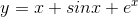
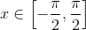
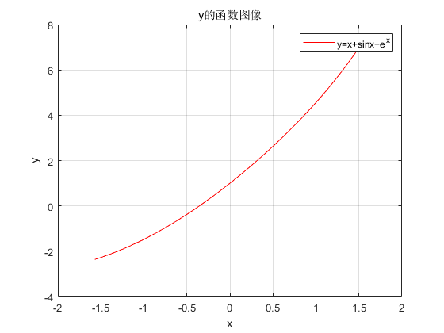
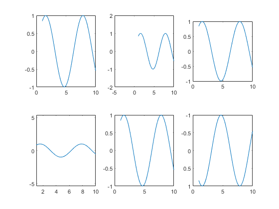
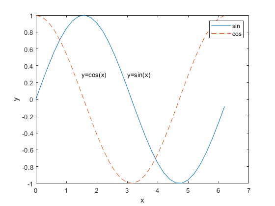
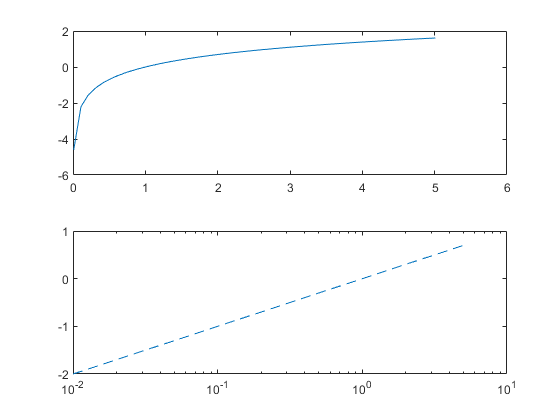

[TOC]

# 图形绘制

图形绘制的基本步骤：

- 数据准备：主要工作是产生出自变量采样向量，计算相应的函数值向量
- 选定图形窗口及子图位置：在默认情况下，MATLAB系统绘制的图形为figure1、figure2.。。。
- 调用绘图函数绘制图形
- 设置坐标轴的范围、刻度及坐标网格
- 利用对象属性值或者图形窗口工具设置线型、标记类型及其大小等
- 添加图形注释，例如图名、坐标名称、图例、文字说明等
- 图形的到处与打印

在上的图像

```matlab
x = -pi/2:0.01:pi/2;
y = x+sin(x)+exp(x);
plot(x,y,'-r');
grid on
title('y的函数图像');
xlabel('x');
ylabel('y');
legend('y=x+sinx+e^{x}');
```

结果如图所示：



# 二维图形绘制

## plot

plot指令用来绘制二维图像，主要调用形式如下：

```matlab
plot(Y);%相当于plot(1:length(Y),Y)
plot(X,Y);%X，Y均为实向量且维数相同
plot(X1,Y1,X2,Y2...Xn,Yn);
plot(X,Y,S);%S表示字符串的线型和颜色
```

| 线型 | 说明       | 标记符 | 说明     | 颜色 | 说明       |
| ---- | ---------- | ------ | -------- | ---- | ---------- |
| -    | 实线(默认) | +      | 加号符   | r    | **红色**   |
| --   | 双划线     | o      | 空心圆   | g    | **绿色**   |
| :    | 虚线       | *      | 星号     | b    | **蓝色**   |
| :.   | 点划线     | .      | 实心圆   | c    | **青绿色** |
|      |            | x      | 叉号符   | m    | **洋红色** |
|      |            | s      | 正方形   | y    | **黄色**   |
|      |            | d      | 菱形     | k    | 黑色       |
|      |            | ^      | 上三角形 | w    | 白色       |
|      |            | v      | 下三角形 |      |            |
|      |            | >      | 右三角形 |      |            |
|      |            | <      | 左三角形 |      |            |
|      |            | p      | 五角星   |      |            |
|      |            | h      | 六边形   |      |            |

## fplot

fplot默认在区间[-5,5]绘制函数y=f(x)定义的曲线，调用格式如下

```
fplot(@(x) sin(x));%绘制sin(x)函数
%****************************
%绘制参数曲线
xt=@(t) cos(3*t);
yt=@(t) sin(2*t);
fplot(xt,xy);
%****************************
%绘制分段函数
fplot(@(x) exp(x),[-3 0],'b')
hold on
fplot(@(x) cos(x),[0 3],'b'）
hold off
```


# 坐标轴设置函数/同一窗口分区

## subplot

subplot函数将一个窗口分为多个区域，每个区域可以绘制不同的图形。

```matlab
subplot(m,n,p);%将窗口拆分成m*n个区域并选择第p个区域
```

## axis

坐标轴设置函数主要针对坐标区间，坐标标注，网格等。

```matlab
x=1:.2:10;
y=sin(x);
subplot(2,3,1);plot(x,y);%绘制一条曲线
subplot(2,3,2);plot(x,y);axis([-5,10,-2,2]);%设置横纵坐标区间，格式为axis[xmin,xmax,ymin,ymax]
subplot(2,3,3);plot(x,y);axis square;%将坐标轴的横纵长度设为相同，此时图像为正方形
subplot(2,3,4);plot(x,y);axis equal;%将坐标轴单位长度设为相等
subplot(2,3,5);plot(x,y);axis auto;%将坐标轴设为默认
subplot(2,3,6);plot(x,y);axis ij;%水平轴从左到右取值，垂直坐标从上到下取值;axis xy 垂直坐标从下到上取值
```

图像如下：



除此之外，xlim和ylim可分别设置横纵坐标的区间值（），格式如下

```matlab
XL=xlims;%取得当前横坐标区间
xlim([xmin,xmax]);%设置横坐标区间
```

## 添加标注

```matlab
x=0:.2:2*pi;
y1=sin(x);
y2=cos(x);
plot(x,y1,'-');
hold on;%保持住
plot(x,y2,'--');
xlabel('x');ylabel('y');%给横纵坐标添加标注
legend('sin','cos');%给图形添加标注
text(3,0.3,'y=sin(x)');%在坐标轴指定位置添加字符串
text(1.5,0.3,'y=cos(x)');
```

图形如下：



- grid on：添加网格
- box on：添加边框

# 单对数坐标图

semilogx和semilogy的调用形式与功能与plot函数完全相同，不同之处在于仅限于：semilogx函数的X轴以对数坐标的形式显示，而semilogy函数的Y轴以对数坐标的形式显示。

```matlab
x=0:.1:5;
x=x+0.01;
subplot(2,1,1);plot(x,log(x));
subplot(2,1,2);semilogx(x,log10(x),'--');
```



# 三维图形绘制

## mesh

```matlab
[X,Y]=meshgrid(-8:.5:8);
R=sqrt(X.^2+Y.^2)+eps;
Z=sin(R)./R;
mesh(X,Y,Z);
```

