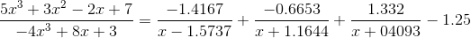

[TOC]

# 1、多项式

## 1.1、多项式的表达式和创建

MATLAB中多项式的创建通过降幂次序存放的向量创建，缺少的幂次的系数为0，我们手写一个我们以为例。

````matlab
p=[3 -10 0 15 1000];%创建多项式
pprintf(p);%多项式字符输出
roots(p);%多项式求根
````

除此之外MATLAB可根据多项式的解，创建多项式，如我们以上图的解创建多项式

```matlab
r=[4.0283 + 2.8554i;4.0283 - 2.8554i;-2.3616 + 2.8452i;-2.3616 - 2.8452i];
p=poly(r);
```

## 1.2、多项式运算

### 1.2.1、加法

MATLAB并未提供多项式加法的函数，可以参照向量加法的形式，但是低阶多项式要用零售填补。这里手写一个函数实现多项式加法[ppadd.m](code/ppadd.m)。调用格式：`ppadd(a,b)`。

### 1.2.2、乘法/除法

```matlab
c=conv(a,b);%多项式乘法
[x,y]=deconv(a,b);%多项式除法，x为商，y为余数
```

## 1.3、多项式的导数、积分和估值

```matlab
d=[1,5,15,35,69,100,118,110,72];
e=polyder(d);%求导
f=ployint(d);%求导

x=-1:0.01:1;
g=[1 3 5 7 9];
h=polyval(g,x);%估值
```

## 1.4、有理多项式

有理多项式由它们的分子多项式和分母多项式表示。

```matlab
num=[5 3 -2 7]; %分子多项式
den=[-4 0 8 3]; %分母多项式
[r,p,k]=residue(num,den);
```

如下式所示



返回的r表示拆分后的分子集合，p表示分母常数项集合，k表示常数项。

# 2、数据插值

# 3、函数的极限

```matlab
f=(3*x^2)/(3*x^2-2*x+1);
limit(f,x,1);%表示函数f，当x趋向于1时的极限,若是求左（右）极限，可加第四个参数'left'（'right'）
```

# 4、函数数值积分


